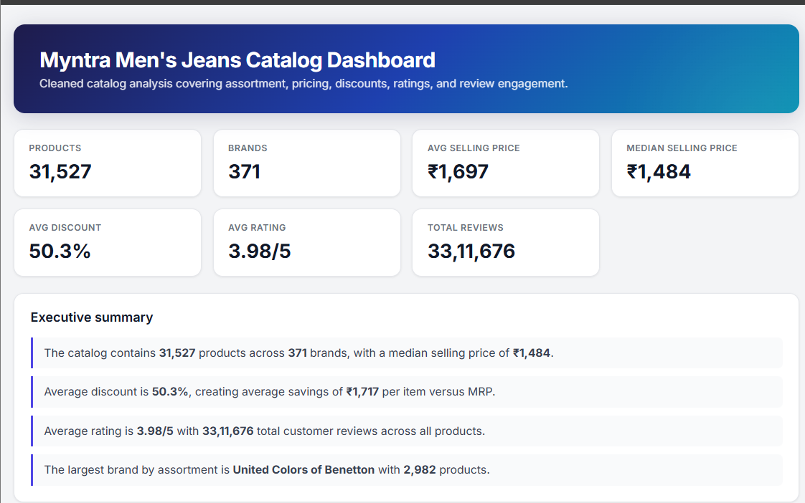
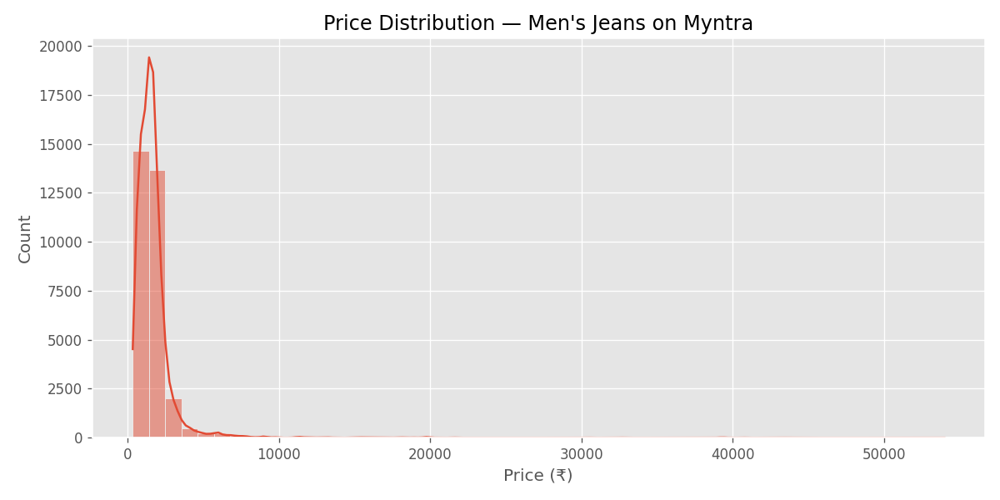
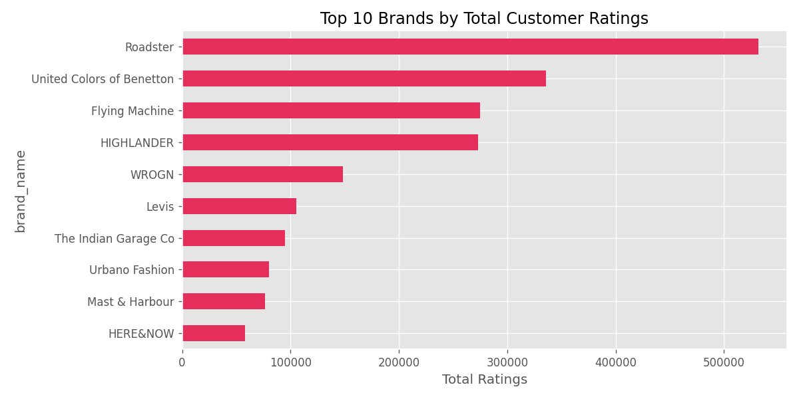
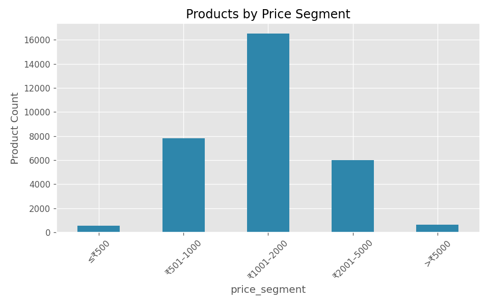

# Myntra Men's Jeans Data Analysis & Power BI Analytics

**Author:** [Aniket Langote](https://github.com/aniketlangote03) · [LinkedIn](https://www.linkedin.com/in/aniketlangote03)


An end-to-end data analytics and business intelligence project analyzing Myntra's men's jeans product catalog to uncover pricing trends, brand performance, discount strategies, customer engagement patterns, and strategic merchandising recommendations.

---

## Table of Contents

- [Project Highlights](#project-highlights)
- [Dashboards & Analytics Suite](#dashboards--analytics-suite)
  - [Power BI Dashboard](#1-power-bi-dashboard-powerbi)
  - [Interactive HTML Dashboard](#2-interactive-html-dashboard)
  - [Streamlit Web Application](#3-streamlit-dashboard)
- [Key Visualizations](#key-visualizations)
- [Project Overview](#project-overview)
- [Dataset Information](#dataset-information)
- [Project Structure](#project-structure)
- [Technologies Used](#technologies-used)
- [Skills Demonstrated](#skills-demonstrated)
- [Business Questions](#business-questions)
- [Key Findings](#key-findings)
- [Methodology & Composite Models](#methodology--composite-models)
- [How to Run the Project](#how-to-run-the-project)
- [Future Improvements](#future-improvements)
- [License & Usage](#license--usage)

---

## Project Highlights

- **52,120 Raw Records Processed:** Handled missing data, deduplicated 17,047 duplicate listings, and corrected scraper scale anomalies down to **31,527 high-integrity records**.
- **Interactive Power BI Dashboard (`PowerBi/Myntra Sales Analytics.pbix`):** Executive-ready BI dashboard file featuring custom DAX calculated measures, interactive dynamic slicers, price tier analytics, and brand performance matrices.
- **5 Structured Analytics Notebooks:** Modular end-to-end Python pipeline spanning data loading, quality assessment, cleaning, exploratory analysis (EDA), and advanced business insights.
- **Interactive HTML Dashboard:** Web-based data dashboard powered by Plotly.js (`dashboard/index.html`) featuring 7 KPI cards, 6 dynamic charts, and interactive tables.
- **Interactive Streamlit Web App:** Real-time web application (`dashboard/app.py`) with customizable filters for price tiers, brand performance scores, and minimum catalog thresholds.
- **Composite Scoring Models:** Formulated data-driven **Value Score** and **Business Performance Score** models to evaluate and rank 371 brands objectively.
- **Automated Deliverables:** Integrated Python workflow (`reports/generate_deliverables.py`) producing an executive Word report (`.docx`), PowerPoint presentation (`.pptx`), and PDF report export.

---

## Dashboards & Analytics Suite

### 1. Power BI Dashboard (`PowerBi/`)

The repository includes a dedicated Microsoft Power BI Desktop report file located at [`PowerBi/Myntra Sales Analytics.pbix`](file:///d:/3rdsem%20project/Myntra-Data-Analysis/PowerBi/Myntra%20Sales%20Analytics.pbix) designed for executive reporting and stakeholder decision-making.

> [!NOTE]  
> **Power BI File Path:** [`PowerBi/Myntra Sales Analytics.pbix`](file:///d:/3rdsem%20project/Myntra-Data-Analysis/PowerBi/Myntra%20Sales%20Analytics.pbix)  
> Open with **Microsoft Power BI Desktop** to explore interactive filters, custom DAX metrics, and brand breakdown visuals.

**Key Dashboard Features & Metrics:**
- **Executive Summary KPI Cards:** Real-time view of catalog metrics including Total Products (31.5K), Total Brands (371), Average Selling Price (₹1,697), Median Price (₹1,484), Average Discount (~50%), and Total Customer Reviews (3.31M).
- **Brand Performance & Market Mix:** Head-to-head performance matrix ranking brands by product volume, average customer rating, discount reliance, and total review engagement.
- **Price Distribution & Promotional Matrix:** Visual distribution across catalog price bands (Budget, Mid-Range, Premium, Luxury) overlaid with discount depth.
- **Custom DAX Measures:** Includes weighted customer rating calculations, engagement efficiency ratios, price elasticity proxies, and normalized brand value rankings.
- **Interactive Dynamic Slicers:** Filter instantly by brand name, price tier, customer rating thresholds, and promotional discount depth.

---

### 2. Interactive HTML Dashboard

A standalone, browser-ready web dashboard built with **Plotly.js** and styled with custom CSS for web-based visual exploration.



**Features:**
- 7 Executive KPI summary cards.
- Price distribution histogram with embedded box plot.
- Top 15 brands by product count, color-coded by rating.
- Product mix across price bands with discount overlays.
- Scatter plot analyzing Price vs. Rating vs. Discount Depth vs. Review Volume (2,000 sampled products).
- Searchable brand performance table and top-rated product listings.

> To view the HTML dashboard, open `dashboard/index.html` in any web browser or serve locally:
> ```bash
> cd dashboard && python -m http.server 8080
> ```

---

### 3. Streamlit Dashboard

A real-time, interactive Python web application built with Streamlit (`dashboard/app.py`).

```bash
streamlit run dashboard/app.py
```

**Features:**
- Sidebar controls for adjusting price segment filters, minimum product thresholds, and brand ranking algorithms.
- Instant ranking updates for **Value Score** and **Business Performance Score**.
- Exportable dynamic tables and interactive Plotly visuals.

---

## Key Visualizations

| Price Distribution | Brand Engagement | Price Segments |
|:---:|:---:|:---:|
|  |  |  |

---

## Project Overview

This project analyzes a scraped dataset of Myntra men's jeans listings to support strategic decision-making around product pricing, merchandising strategy, promotional campaigns, and brand partnerships.

**Core Objectives:**
1. Clean and normalize raw e-commerce catalog data extracted via web scraping.
2. Uncover market pricing distributions, discount depths, and customer rating dynamics.
3. Identify top-performing brands and best value-for-money product offerings.
4. Deliver multi-channel business intelligence via **Power BI**, **Streamlit**, **Plotly HTML**, and automated report generation.

---

## Dataset Information

| Attribute | Details |
|-----------|---------|
| **Source** | Myntra catalog product listings (web scraping) |
| **Category** | Men's Jeans |
| **Raw Volume** | 52,120 records |
| **Cleaned Volume** | 31,527 records |
| **Unique Brands** | 371 brands |
| **Attributes** | 7 core features |

### Feature Dictionary

| Column Name | Data Type | Description |
|-------------|-----------|-------------|
| `brand_name` | Categorical | Name of the brand |
| `pants_description` | Categorical | Catalog title / product description |
| `price` | Numerical | Final discounted selling price in INR (₹) |
| `MRP` | Numerical | Maximum Retail Price in INR (₹) |
| `discount_percent` | Numerical | Promotional discount represented as decimal (0.0 – 1.0) |
| `ratings` | Numerical | Average customer rating (1.0 – 5.0 scale) |
| `number_of_ratings` | Numerical | Total count of customer reviews/ratings |

---

## Project Structure

```
Myntra-Data-Analysis/
│
├── PowerBi/
│   └── Myntra Sales Analytics.pbix      # Power BI Dashboard file (Interactive BI Report)
│
├── data/
│   ├── myntra_dataset_ByScraping.csv    # Raw scraped dataset (52,120 rows)
│   └── myntra_cleaned.csv               # Cleaned dataset (31,527 rows)
│
├── notebooks/
│   ├── 01_Data_Loading.ipynb            # Notebook 1: Data loading & initial inspection
│   ├── 02_Data_Quality_Assessment.ipynb # Notebook 2: Data quality & anomaly detection
│   ├── 03_Data_Cleaning.ipynb           # Notebook 3: Deduplication & normalization
│   ├── 04_Exploratory_Data_Analysis.ipynb# Notebook 4: EDA & visual analytics
│   └── 05_Advanced_Business_Insights.ipynb# Notebook 5: Scoring models & brand insights
│
├── dashboard/
│   ├── index.html                       # Standalone Plotly HTML dashboard
│   ├── dashboard_data.json              # Data payload for HTML dashboard
│   ├── generate_dashboard_data.py       # Python pipeline (CSV → JSON converter)
│   ├── app.py                           # Streamlit interactive web application
│   └── assets/
│       └── style.css                    # Custom styling for HTML dashboard
│
├── images/                              # Exported visualization charts & figures
├── scripts/
│   ├── generate_key_charts.py           # Automated chart exporter script
│   └── strip_outputs.py                 # Jupyter notebook cleaning utility
│
├── reports/
│   ├── Myntra_Data_Analysis_Report.docx # Executive Word report
│   ├── Myntra_Data_Analysis_Report.pdf  # Executive PDF report
│   └── Myntra_Data_Analysis_Presentation.pptx # Presentation deck
│
├── SYNOPSIS.md                          # Project synopsis document
├── README.md                            # Comprehensive project documentation
├── requirements.txt                     # Python dependencies
├── .gitignore                           # Git ignore rules
└── LICENSE                              # MIT License
```

---

## Technologies Used

- **Business Intelligence & Dashboards:**
  - **Microsoft Power BI Desktop** – Interactive BI report creation, DAX calculated measures, data modeling, visual analytics (`.pbix`).
  - **Streamlit** – Python-native interactive web application framework.
  - **HTML5 / CSS3 / JavaScript (Plotly.js)** – Lightweight standalone HTML dashboard.

- **Data Processing & Analytics:**
  - **Python 3.12** – Primary programming language.
  - **Pandas** – Data manipulation, data cleaning, and aggregation.
  - **NumPy** – High-performance numerical computations.

- **Visualization Libraries:**
  - **Matplotlib & Seaborn** – Static statistical plots and exploratory figures.
  - **Plotly Express & Graph Objects** – Interactive web chart components.

- **Reporting & Automation:**
  - **python-docx & python-pptx** – Automated report and slide deck generation.
  - **Jupyter Notebook / JupyterLab** – Reproducible interactive computing environment.

---

## Skills Demonstrated

- **Data Quality & Hygiene:** Advanced deduplication, outlier identification, and scraper anomaly normalization.
- **Business Intelligence & DAX:** Building interactive dashboards in Power BI with custom measures and slicers.
- **Exploratory Data Analysis (EDA):** Univariate, bivariate, and multivariate distribution analysis across e-commerce categories.
- **Composite Scoring Models:** Multi-criteria weighted normalization (Value Score & Business Performance Score).
- **Multi-Platform Dashboarding:** Designing synchronized web apps (Streamlit), BI files (Power BI), and client-side web dashboards (HTML/Plotly).
- **Executive Communication:** Automated multi-format reporting (.docx, .pdf, .pptx).

---

## Business Questions & Strategic Insights

### Exploratory Data Analysis
1. **Price Distribution:** What is the selling price distribution across Myntra's men's jeans catalog?
2. **Brand Pricing Hierarchy:** Which brands command premium pricing versus mass-market budget prices?
3. **Rating Patterns:** How do customer satisfaction scores vary across price segments?
4. **Volume Dominance:** Which brands lead the market in total catalog listings and review engagement?

### Advanced Business Insights
1. **Value Champion Identification:** Which brands deliver the optimal balance of rating, discount depth, and price affordability (Value Score)?
2. **Engagement & Ratings:** Which brands achieve high customer ratings while maintaining massive review volumes?
3. **Promotional Dependency:** Which brands rely most heavily on steep discount structures (>60%) to drive volume?
4. **Merchandising Prioritization:** Which brand partners should Myntra prioritize for marketing campaigns and catalog expansion (Business Performance Score)?

---

## Key Findings

- **Dataset Cleanliness:** Cleaned raw data by stripping **17,047 duplicate listings** and **3,546 invalid discount records**, resulting in **31,527 high-integrity product listings**.
- **Mid-Range Dominance:** 50% of the catalog falls in the mid-range price segment (₹899 – ₹1,829), with an average catalog price of ₹1,697 and a median price of ₹1,484.
- **Engagement Leaders:** **Roadster**, **HIGHLANDER**, and **United Colors of Benetton** account for the highest aggregate review volumes.
- **Top Business Performance Brands:** Composite modeling highlights **HIGHLANDER**, **HARDSODA**, **Sztori**, and **THE BEETEL HOUSE** as top-tier brand candidates for platform growth.

---

## Methodology & Composite Models

### 1. Value Score Formula
Evaluates consumer value proposition using weighted min-max normalized metrics:

| Metric Component | Weight | Calculation Method |
|------------------|--------|--------------------|
| **Rating Score** | 40% | $\frac{\text{Avg Rating}}{\text{Max Rating}}$ |
| **Discount Score** | 30% | $\frac{\text{Avg Discount}}{\text{Max Discount}}$ |
| **Price Affordability Score** | 30% | $\frac{\text{Min Price}}{\text{Avg Price}}$ |

$$\text{Value Score} = 0.40 \times \text{Rating} + 0.30 \times \text{Discount} + 0.30 \times \text{Price Affordability}$$

---

### 2. Business Performance Score Formula
Ranks brand partners for executive prioritization:

| Metric Component | Weight | Description |
|------------------|--------|-------------|
| **Normalized Customer Rating** | 35% | Per-brand average rating scale |
| **Normalized Review Volume per Product** | 30% | Customer engagement efficiency |
| **Normalized Value Score** | 20% | Price-to-quality value index |
| **Normalized Discount Depth** | 15% | Promotional activity level |

---

## How to Run the Project

### 1. Clone the Repository

```bash
git clone https://github.com/aniketlangote03/Myntra-Data-Analysis.git
cd Myntra-Data-Analysis
```

### 2. Open the Power BI Dashboard

1. Install **Microsoft Power BI Desktop** (available free for Windows).
2. Open [`PowerBi/Myntra Sales Analytics.pbix`](file:///d:/3rdsem%20project/Myntra-Data-Analysis/PowerBi/Myntra%20Sales%20Analytics.pbix).
3. Interact with dynamic slicers, KPI summary metrics, and visual cards.

### 3. Setup Python Virtual Environment

```bash
python -m venv venv

# Windows
venv\Scripts\activate

# macOS / Linux
source venv/bin/activate

# Install dependencies
pip install -r requirements.txt
```

### 4. Execute Analysis Notebooks

Run Jupyter Lab or Notebook:
```bash
jupyter lab
```
Execute notebooks 01 through 05 sequentially in `notebooks/`.

### 5. Launch Web Dashboards

- **Interactive HTML Dashboard:**
  ```bash
  python dashboard/generate_dashboard_data.py
  cd dashboard && python -m http.server 8080
  ```
  Open `http://localhost:8080` in your browser.

- **Streamlit Web Application:**
  ```bash
  streamlit run dashboard/app.py
  ```

---

## Future Improvements

- Add size and color attribute breakdown for multi-dimensional stock analysis.
- Build automated web scrapers to support real-time time-series price tracking.
- Apply machine learning models (Regression/XGBoost) for automated price & demand elasticity modeling.
- Publish the Power BI dashboard to Power BI Service for embedded web sharing.

---

## License & Usage

- **Code & Assets License:** Licensed under the [MIT License](LICENSE).
- **Dataset Notice:** Catalog dataset was gathered from public e-commerce listings on Myntra for academic research and portfolio demonstration.
