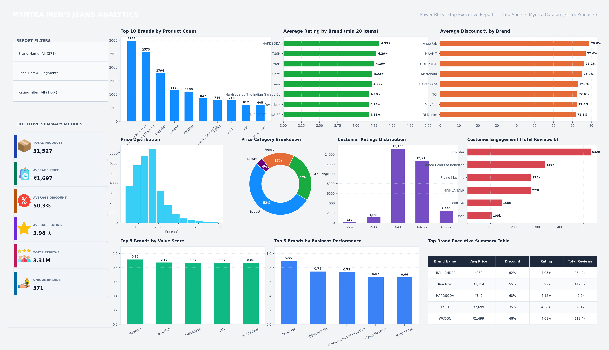

# Myntra Men's Jeans Data Analysis

**Author:** [Aniket Langote](https://github.com/aniketlangote03) · [LinkedIn](https://www.linkedin.com/in/aniketlangote03)


An end-to-end data analytics project analyzing Myntra's men's jeans product catalog to uncover pricing trends, brand performance, discount strategies, and customer engagement patterns.

> **Note:** Do not commit the `venv/` folder — it is listed in `.gitignore`. Always create a local virtual environment after cloning.

## Project Highlights

- **52,120 Raw Records Cleaned:** Handled missing data, deduplicated 17,047 duplicate listings, and cleaned scraper scale anomalies down to 31,527 high-quality records.
- **5 Structured Analytics Notebooks:** Modular end-to-end pipeline following data loading, quality assessment, cleaning, EDA, and advanced business insights.
- **Interactive HTML Dashboard:** A data-driven web dashboard built with Plotly, powered by real data extracted via Python — 7 KPI cards, 6 interactive charts, and dynamic tables.
- **Interactive Streamlit Dashboard:** Built a real-time web application (`dashboard/app.py`) for filtering brands, price tiers, and performance scores.
- **Composite Scoring Models:** Developed Value Score and Business Performance Score to rank 371 brands objectively.
- **Automated Deliverables:** Python automation (`reports/generate_deliverables.py`) producing executive DOCX report, PPTX presentation, and PDF export.

## Dashboards

### Interactive HTML Dashboard

This project includes a standalone HTML dashboard built with **Plotly.js** that visualizes key insights from the cleaned Myntra dataset. The dashboard is powered by `dashboard_data.json`, which is generated from the actual CSV data using Python (Pandas) — no simulated or hardcoded values.


**Features:**
- 7 KPI cards (Products, Brands, Avg Price, Median Price, Avg Discount, Avg Rating, Total Reviews)
- Price distribution histogram with box plot
- Top 15 brands by product count (color-coded by rating)
- Product mix by price band with discount overlay
- Discount spread box plots across price bands
- Top 10 brands by average rating
- Scatter plot: Price vs Rating vs Discount vs Review volume (2,000 sampled products)
- Brand performance table and top-rated products table

> To view the dashboard, open `dashboard/index.html` in any modern browser, or run a local server:
> ```bash
> cd dashboard && python -m http.server 8080
> ```

### Power BI Dashboard

A professional business intelligence dashboard built with **Power BI Desktop**, designed for stakeholder-facing analytics.

<!--  -->

**Features:**
- KPI cards for key metrics
- Interactive slicers for brand, price segment, and rating
- Brand performance comparison
- Price distribution and discount analysis
- DAX measures for calculated metrics

> Open `dashboard/Myntra_Dashboard.pbix` in Power BI Desktop to explore the interactive dashboard.

### Streamlit Dashboard

A real-time interactive dashboard (`dashboard/app.py`) with sidebar filters for price segments, minimum product thresholds, and brand ranking criteria.

```bash
streamlit run dashboard/app.py
```

## Key Visualizations

| Price Distribution | Brand Engagement | Price Segments |
|:---:|:---:|:---:|
|  |  |  |

## Project Overview

This project analyzes a scraped dataset of Myntra men's jeans listings to support data-driven business decisions around pricing, merchandising, marketing, and brand partnerships. The workflow follows a standard analytics pipeline: data loading, quality assessment, cleaning, exploratory analysis, and advanced business insights.

**Business objective:** Identify pricing trends, brand performance, discount strategies, customer preferences, and product popularity to improve pricing, marketing, and customer satisfaction on Myntra's platform.

## Dataset Information

| Attribute | Details |
|-----------|---------|
| **Source** | Myntra product listings (web scraping) |
| **Category** | Men's Jeans |
| **Original records** | 52,120 products |
| **Cleaned records** | 31,527 products |
| **Unique brands** | 371 |
| **Features** | 7 columns |

### Columns

| Column | Type | Description |
|--------|------|-------------|
| `brand_name` | Categorical | Brand of the product |
| `pants_description` | Categorical | Product description / title |
| `price` | Numerical | Selling price (₹) |
| `MRP` | Numerical | Maximum retail price (₹) |
| `discount_percent` | Numerical | Discount as decimal (0–1) |
| `ratings` | Numerical | Average customer rating (1–5) |
| `number_of_ratings` | Numerical | Total number of customer ratings |

### Key Statistics (Cleaned Dataset)

- **Average price:** ₹1,697 | **Median price:** ₹1,484
- **Price range:** ₹337 – ₹54,000
- **Average rating:** 3.98 / 5
- **Average discount:** ~50% (stored as decimal 0–1)
- **Total customer reviews:** 3,311,676

## Project Structure

```
Myntra-Data-Analysis/
│
├── data/
│   ├── myntra_dataset_ByScraping.csv    # Raw scraped dataset
│   └── myntra_cleaned.csv               # Cleaned dataset for analysis
│
├── notebooks/
│   ├── 01_Data_Loading.ipynb
│   ├── 02_Data_Quality_Assessment.ipynb
│   ├── 03_Data_Cleaning.ipynb
│   ├── 04_Exploratory_Data_Analysis.ipynb
│   └── 05_Advanced_Business_Insights.ipynb
│
├── dashboard/
│   ├── index.html                       # Interactive HTML dashboard (Plotly)
│   ├── dashboard_data.json              # Auto-generated data for HTML dashboard
│   ├── generate_dashboard_data.py       # Python script: CSV → JSON
│   ├── app.py                           # Streamlit interactive dashboard
│   └── assets/
│       └── style.css                    # Dashboard stylesheet
│
├── images/                              # Exported charts and visualizations
│
├── scripts/
│   ├── generate_key_charts.py           # Export key charts to images/
│   ├── fix_notebooks.py                 # Notebook cleanup utility
│   ├── fix_all_notebooks.py             # Fix text errors across notebooks
│   ├── rebuild_nb04.py                  # Lean EDA notebook builder
│   ├── consolidate_nb04.py              # Legacy NB4 duplicate removal
│   └── strip_outputs.py                 # Clear notebook outputs before commit
│
├── reports/
│   ├── Myntra_Data_Analysis_Report.docx # Final written report (Word)
│   ├── Myntra_Data_Analysis_Report.pdf  # Executive report (PDF export)
│   └── Myntra_Data_Analysis_Presentation.pptx # Presentation deck
│
├── README.md
├── requirements.txt
├── .gitignore
└── LICENSE
```

## Technologies Used

- **Python 3.12** – Core language for data processing
- **pandas** – Data manipulation and analysis
- **NumPy** – Numerical operations
- **Matplotlib & Seaborn** – Static data visualization
- **Plotly** – Interactive charts (HTML dashboard & Streamlit)
- **Power BI** – Business intelligence dashboard with DAX measures and interactive slicers
- **Streamlit** – Interactive web dashboard application
- **HTML / CSS / JavaScript** – Standalone HTML dashboard
- **Jupyter Notebook / JupyterLab** – Interactive analysis environment

## Skills Demonstrated

- **Data Cleaning & Quality Assessment:** Anomaly detection, duplicate deduplication, scraper format normalization.
- **Exploratory Data Analysis (EDA):** Univariate/bivariate distribution analysis, price segmentation, metric aggregations.
- **Data Visualization:** Custom Seaborn, Matplotlib, and Plotly interactive charts.
- **Feature Engineering & Composite Scoring:** Min-max normalization and multi-criteria weighted scoring (Value Score & Business Performance Score).
- **Interactive Web Dashboarding:** HTML/CSS/JS dashboard with Plotly, plus Streamlit apps with responsive filters.
- **Data Pipeline Design:** Python script to extract, transform, and export data as JSON for front-end consumption.
- **Executive Communication:** Automated report generation (DOCX/PDF/PPTX) and actionable data storytelling.

## Business Questions

### Exploratory Data Analysis (Notebook 4)

1. What is the price distribution of men's jeans on Myntra?
2. Which brands have the highest average prices?
3. How do customer ratings vary across price segments?
4. Which brands dominate the budget segment?
5. How are products distributed across price categories (Budget, Mid-Range, Premium, Luxury)?

### Advanced Business Insights (Notebook 5)

1. Which brands provide the best value for money?
2. Which brands combine high customer ratings with strong customer engagement?
3. Which brands rely most heavily on promotional discounts?
4. Which price segment performs best?
5. Which brands should Myntra prioritize?

## Key Findings

### Data Quality & Cleaning
- No missing values in the raw dataset.
- Removed **17,047 exact duplicate rows** (52,120 → 35,073 records).
- Removed **3,546 records** with inconsistent discount format (values outside the 0–1 decimal range due to scraper inconsistency), yielding **31,527 clean records**.

### EDA Highlights
- Most products sit in the **mid-range pricing segment** (₹899–₹1,829 for 50% of catalog).
- Price distribution is **right-skewed** — a few luxury items (up to ₹54,000) pull the mean above the median.
- **Roadster**, **HIGHLANDER**, and **United Colors of Benetton** lead in customer engagement.
- Premium products receive slightly higher ratings but lower overall engagement.

### Advanced Insights
- **Best value for money:** MarvelQ, AngelFab, Metronaut, SZN, HARDSODA (composite Value Score).
- **Highest engagement efficiency:** HIGHLANDER leads in ratings per product; Roadster leads in total ratings.
- **Mid-price segment (₹1,001–2,000)** is the core of the catalog with strongest engagement.
- **Top priority brands:** HIGHLANDER, HARDSODA, Sztori, THE BEETEL HOUSE (Business Performance Score).

## Methodology

### Value Score (Notebook 5, BQ1)

Per-brand metrics are normalized, then combined with fixed weights:

| Component | Weight | Formula |
|-----------|--------|---------|
| Rating Score | 40% | `avg_rating / max(avg_rating)` |
| Discount Score | 30% | `avg_discount / max(avg_discount)` |
| Price Score | 30% | `min(avg_price) / avg_price` |

**Value Score** = 0.40 × Rating + 0.30 × Discount + 0.30 × Price

Higher scores indicate brands that balance affordability, promotions, and customer satisfaction.

### Business Performance Score (Notebook 5, BQ5)

Key metrics are min-max normalized to [0, 1], then weighted:

| Component | Weight |
|-----------|--------|
| Average Rating (norm) | 35% |
| Ratings per Product (norm) | 30% |
| Value Score (norm) | 20% |
| Average Discount (norm) | 15% |

This composite score ranks brands for merchandising and partnership prioritization.

## How to Run the Project

### 1. Clone the repository

```bash
git clone https://github.com/aniketlangote03/Myntra-Data-Analysis.git
cd Myntra-Data-Analysis
```

### 2. Create and activate a virtual environment

```bash
python -m venv venv

# Windows
venv\Scripts\activate

# macOS / Linux
source venv/bin/activate
```

### 3. Install dependencies

```bash
pip install -r requirements.txt
```

### 4. Launch Jupyter

```bash
jupyter lab
# or
jupyter notebook
```

### 5. Run notebooks in order

Open and execute notebooks sequentially from `notebooks/`:

1. `01_Data_Loading.ipynb`
2. `02_Data_Quality_Assessment.ipynb`
3. `03_Data_Cleaning.ipynb`
4. `04_Exploratory_Data_Analysis.ipynb`
5. `05_Advanced_Business_Insights.ipynb`

> **Note:** Notebooks 4 and 5 read from `data/myntra_cleaned.csv`, which is produced by Notebook 3. Charts are saved to `images/` when you run the notebooks, or you can generate key charts with:

```bash
python scripts/generate_key_charts.py
```

### 6. Launch the HTML dashboard

```bash
# Regenerate data from CSV (run after any data changes)
python dashboard/generate_dashboard_data.py

# Serve the dashboard locally
cd dashboard && python -m http.server 8080
```

Open [http://localhost:8080](http://localhost:8080) in your browser.

### 7. Launch the Streamlit dashboard

```bash
streamlit run dashboard/app.py
```

Opens a browser dashboard with price filters, brand rankings (Value Score, Business Performance Score), and segment analysis. Brand rankings default to **≥ 20 products per brand**, matching Notebook 5's reliability filter.

### 8. Generate report deliverables (optional)

```bash
pip install python-docx python-pptx docx2pdf
python reports/generate_deliverables.py
```

Generates `Myntra_Data_Analysis_Report.docx`, `Myntra_Data_Analysis_Presentation.pptx`, and `Myntra_Data_Analysis_Report.pdf`.

## Future Improvements

- Add **size and color attributes** to enable finer-grained product analysis.
- Implement **time-series tracking** to monitor price and discount changes over time.
- Expand analysis to **other product categories** (shirts, footwear, etc.).
- Apply **machine learning** for price prediction and recommendation systems.
- Automate data collection with scheduled web scraping pipelines.
- Add **interactive filters** (brand dropdown, price slider, rating filter) to the HTML dashboard.

## License

This project is licensed under the [MIT License](LICENSE). Dataset sourced via web scraping; use in accordance with Myntra's terms of service.
